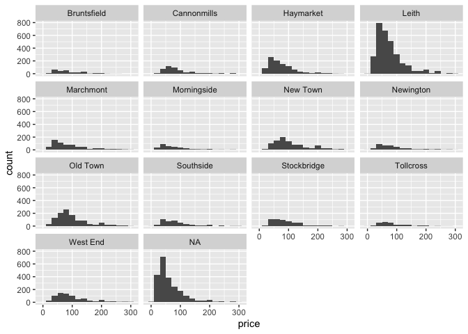

HW 01 (?) - Airbnb listings in Edinburgh
================
Gerrit
2023-01-19

## Load packages and data

``` r
library(tidyverse)
library(dsbox)
```

## Exercises

### Exercise 1

there are 13245 entries in the data set.

### Exercise 2

each row represesnts a different AirBNB in Edinurgh.

### Exercise 3

facet wrapped to 4 rows, since it seemed to make the graphs large enough
to be visible, and filtered to prices \< 500, so that the bulk of the
data is actually large enough to compare.

``` r
ggplot(data = edibnb %>% filter(price < 300), mapping = aes(x = price))+
  geom_histogram(stat = "bin", binwidth = 20)+
  facet_wrap(~neighbourhood, nrow = 4)
```

<!-- -->

### Exercise 4

Remove this text, and add your answer for Exercise 4 here.

bechdel90_13 %\>% group_by(binary) %\>% summarise( med_budget =
median(budget_2013), med_domgross = median(domgross_2013, na.rm = TRUE),
med_intgross = median(intgross_2013, na.rm = TRUE) )

``` r
#edibnb %>%
#  group_by(edibnb$neighbourhood) %>%
#    med_price = median(edibnb$price, na.rm = TRUE) %>%
#    arrange(edibnb$neighbourhood, n)%>%
#    slice_max(n, n=5)

edibnb %>%
  filter(!is.na(price))%>%
  group_by(neighbourhood) %>%
  summarise(med_price = median(price)) %>%
  top_n(n = 5, med_price) %>%
  arrange(desc(med_price)) %>%
  print()
```

    ## # A tibble: 7 × 2
    ##   neighbourhood med_price
    ##   <chr>             <dbl>
    ## 1 New Town            100
    ## 2 Old Town             90
    ## 3 West End             90
    ## 4 Stockbridge          85
    ## 5 Bruntsfield          80
    ## 6 Marchmont            80
    ## 7 Southside            80

``` r
# remove this comment and add the code for Exercise 4 here
```

``` r
# remove this comment and add the code for Exercise 4 here
```

### Exercise 5

Remove this text, and add your answer for Exercise 5 here.

``` r
# remove this comment and add the code for Exercise 5 here
```
